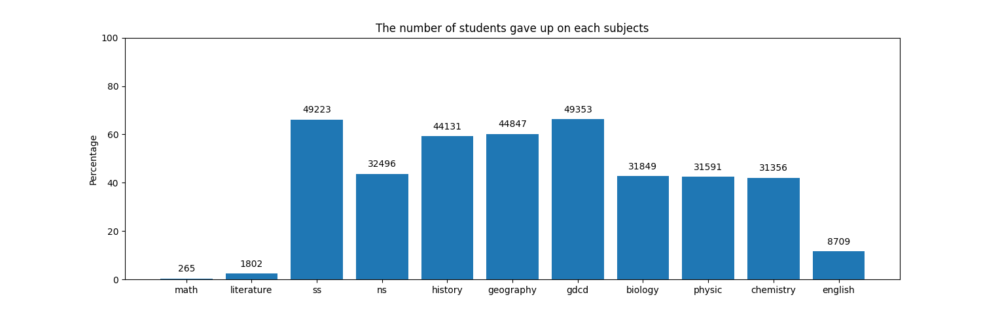
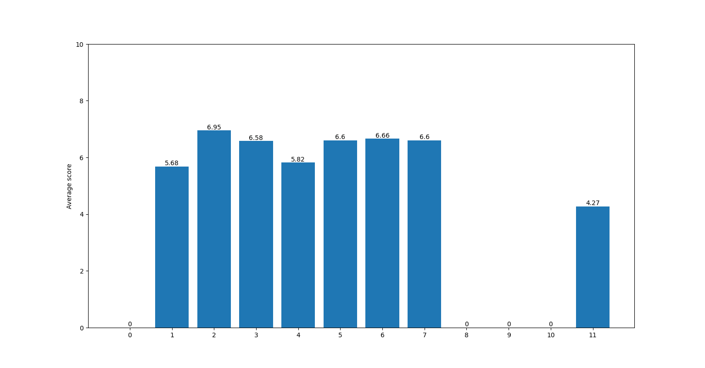
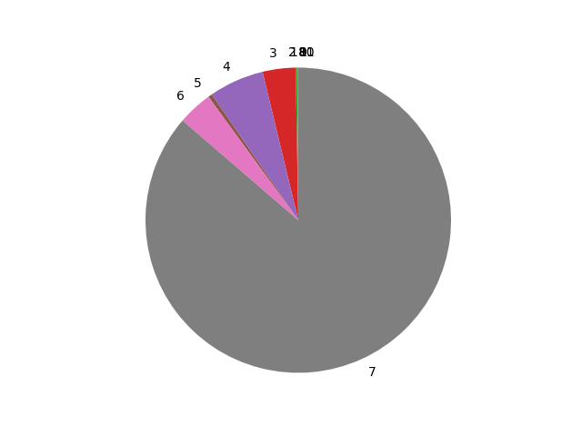
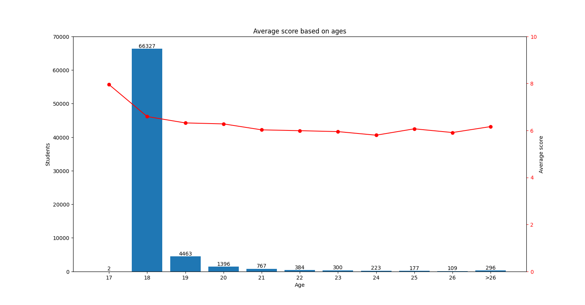

# Score analysis on VietNam national examination (2020)
This repository cleans data collected from offical website (not available anymore) in raw_data.txt. The purpose is for analysing, plotting and observing the results of contestants.
  - data in raw_data.txt contains html, encoded string that presents Vietnamese letters
  - cleaning.py converts raw data into csv format, with -1 represnts N/A, write the output to clean_data.csv

## Barchart
  - The amount of contestants quit on each subjects
  

  - Average score based on number of subjects taken
  

## Piechart
  - The distribution of number subjects taken
  

## Barchart combined with line chart
  - Average score based on students' age
  
